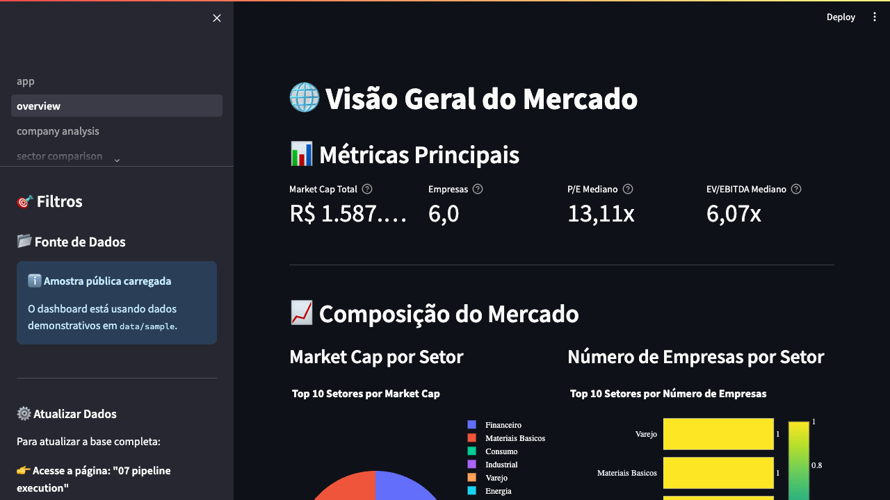

# Finance CVM Dashboard

[](https://github.com/kleberAbreu/finance-cvm-dashboard/actions/workflows/ci.yml)
[](LICENSE)
[](https://www.python.org/)
[](https://streamlit.io/)

Dashboard em Streamlit para analisar demonstrativos financeiros de companhias
brasileiras a partir de dados públicos da CVM, enriquecidos com preços de
mercado via Yahoo Finance.

O projeto foi preparado para uso local: clone, instale as dependências e rode.
Não há login obrigatório. Uma amostra pequena em `data/sample/` permite abrir o
dashboard imediatamente, mesmo antes de gerar a base completa.



> Este projeto é uma ferramenta educacional e analítica. Ele não é recomendação
> de investimento, consultoria financeira, contábil ou jurídica.

## Demonstração online

[Abrir Dashboard Financeiro CVM](https://www.kleberabreu.com.br/dashboard/)

A demonstração usa uma amostra congelada de seis empresas, com oito trimestres
entre 2024 e 2025. Os valores são demonstrativos e não representam cotações
atuais. Não há login, upload de arquivos ou atualização do pipeline por visitantes.
Os filtros e as exportações CSV/Excel estão disponíveis; as exportações mantêm
a identificação de amostra e a unidade monetária.

Para executar a mesma demonstração localmente:

```bash
streamlit run public_app.py --server.baseUrlPath dashboard
```

## Funcionalidades

- Overview de mercado com KPIs, rankings e composição setorial.
- Análise individual de empresas com comparação de pares.
- Comparação setorial, screener, séries temporais e correlações.
- Página de P&L, balanço patrimonial e fluxo de caixa.
- Pipeline CVM + Yahoo Finance para gerar Parquets locais.
- Fallback automático para amostra pública quando a base completa não existe.

## Instalação Local

```bash
git clone https://github.com/kleberAbreu/finance-cvm-dashboard.git
cd finance-cvm-dashboard

python -m venv .venv
source .venv/bin/activate
python -m pip install --upgrade pip
python -m pip install -r requirements.txt

streamlit run app.py
```

Abra `http://localhost:8501`. Se você ainda não gerou os Parquets completos, o
app usará automaticamente a amostra pública.

No Windows, use `RUN.bat`. No macOS/Linux, você também pode usar:

```bash
chmod +x RUN.sh
./RUN.sh
```

## Dados

O dashboard procura primeiro pelos arquivos gerados pelo pipeline:

- `pipeline_cvm_final/outputs/base_consolidada.parquet`
- `pipeline_cvm_final/outputs/resumo_setores.parquet`
- `pipeline_cvm_final/outputs/resumo_mercado.parquet`

Se esses arquivos não existirem, usa:

- `data/sample/base_consolidada.parquet`
- `data/sample/resumo_setores.parquet`
- `data/sample/resumo_mercado.parquet`

A amostra serve apenas para demonstração, testes e onboarding. Para análises
reais, gere sua base localmente:

```bash
python run_pipeline.py --inicio 2018 --fim 2025
```

O pipeline completo pode demorar e depende da disponibilidade dos serviços da
CVM e do Yahoo Finance.

Para validar rapidamente se o Yahoo Finance está respondendo para alguns
tickers líquidos:

```bash
python scripts/validate_yfinance_sample.py
```

## Estrutura

```text
.
├── app.py                    # Entrada principal Streamlit
├── pages/                    # Páginas multipage do Streamlit
├── src/
│   ├── components/           # Sidebar, cards e gráficos
│   ├── data/                 # Loader, pré-processamento e pipeline
│   └── utils/                # Cálculos, validação e formatação
├── config/settings.py        # Caminhos, colunas e opções do app
├── data/sample/              # Parquets pequenos versionados
└── tests/                    # Testes de loader, filtros e cálculos
```

## Autenticação Opcional

O app roda sem login por padrão. Para deploy privado, habilite autenticação fora
do Git com:

```bash
export CVM_DASHBOARD_AUTH=1
```

Depois forneça `auth_config.yaml` localmente ou `st.secrets["auth_config"]` no
ambiente hospedado. Não versione senhas, hashes, tokens ou arquivos de secrets.

## Desenvolvimento

```bash
python -m pip install -r requirements.txt pytest
python -m compileall app.py config src pages tests
pytest -q
```

## Roadmap

- Melhorar cobertura de testes do pipeline contábil.
- Empacotar configuração opcional de deploy privado.
- Criar validações automáticas de anomalias pós-pipeline.
- Adicionar exportação de relatórios analíticos.

## Licença

Distribuído sob licença MIT. Veja [LICENSE](LICENSE). A licença cobre o código;
dados e dependências de terceiros permanecem sujeitos aos termos de suas fontes.
